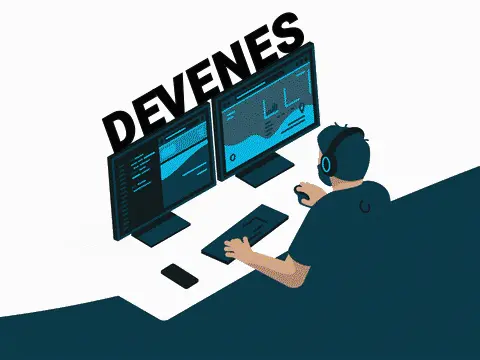

# Enes Turan

### Platform Engineering · Developer Experience · Cloud & Reliability

I build developer platforms, cloud-native infrastructure, and engineering tooling that help teams build, ship, and operate software more effectively.

- Currently working on **Developer Experience & Platform Engineering** at **JumpCloud**.
- Previously at **IBM** and other engineering organizations, working across cloud, infrastructure, Kubernetes, automation, and platform engineering.
- Most of my day-to-day platform work is not public, so this profile focuses on the projects, experiments, writing, and community work I choose to share.

---

### What I work on

- 🛠️ **Developer platforms & internal developer experience**
- ☸️ **Kubernetes & cloud-native infrastructure**
- 🚀 **Software delivery, CI/CD & GitOps**
- 🔭 **Reliability, observability & SRE**
- 🔐 **Cloud & platform security**
- 🤖 **AI / ML platform engineering**

---

### Community & speaking

- ☁️ **Google Developer Expert — Cloud**
- 🌍 **Cloud Native Istanbul**
- 🎙️ Technical speaker & community contributor

---

### Writing

I occasionally write about cloud-native engineering, Kubernetes, platform engineering, infrastructure, and practical engineering problems.

👉 [Medium](https://devenes.medium.com/)

---

### Find me elsewhere

[Website](https://www.enes.software/) &nbsp;·&nbsp; [LinkedIn](https://www.linkedin.com/in/devenes/) &nbsp;·&nbsp; [Medium](https://devenes.medium.com/) &nbsp;·&nbsp; [YouTube](https://www.youtube.com/@cloudnativetr) &nbsp;·&nbsp; [X / Twitter](https://twitter.com/thedevenes)

 

> *Build platforms that make the right thing easy.*
